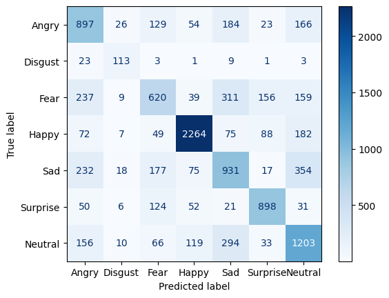

# Emotion Detector 😊😢😠

A CNN-based facial emotion recognition system trained on the FER2013 dataset.


## Overview

This project implements a Convolutional Neural Network (CNN) to classify facial expressions into 7 emotion categories. The model is trained on the FER2013 dataset and achieves real-time inference on CPU.

## Features

- **7 Emotion Classes**: Angry, Disgust, Fear, Happy, Sad, Surprise, Neutral
- **Custom CNN Architecture**: 4 conv blocks + 4 fully connected layers with BatchNorm and Dropout
- **Class Imbalance Handling**: Weighted cross-entropy loss
- **Data Augmentation**: Random horizontal flips and rotations
- **Training Optimizations**: OneCycleLR scheduler, AdamW optimizer, early stopping
- **Simple CLI**: Single command inference

## Installation

```bash
# Clone the repository
git clone https://github.com/yourusername/emotion_detector.git
cd emotion_detector

# Install dependencies (using uv)
uv sync

# Or using pip
pip install -e .
```

## Usage

```bash
python inference.py path/to/image.jpg
```

Example:
```bash
python inference.py test_images/test.png
# Output: Happy
# Inference latency: 0.0042s
```

## Model Architecture

```
Input (48x48 grayscale)
    │
    ├── ConvBlock(1→32)   + BatchNorm + ReLU + MaxPool  → 24x24
    ├── ConvBlock(32→64)  + BatchNorm + ReLU + MaxPool  → 12x12
    ├── ConvBlock(64→128) + BatchNorm + ReLU + MaxPool  → 6x6
    ├── ConvBlock(128→256)+ BatchNorm + ReLU + MaxPool  → 3x3
    │
    ├── Flatten (256×3×3 = 2304)
    │
    ├── FC(2304→512)  + BatchNorm + ReLU + Dropout(0.40)
    ├── FC(512→256)   + BatchNorm + ReLU + Dropout(0.20)
    ├── FC(256→128)   + BatchNorm + ReLU + Dropout(0.10)
    ├── FC(128→64)    + BatchNorm + ReLU + Dropout(0.50)
    │
    └── Output(64→7)
```

## Training Details

| Hyperparameter | Value |
|----------------|-------|
| Optimizer | AdamW |
| Learning Rate | 3e-3 (max) |
| Weight Decay | 1e-4 |
| Batch Size | 100 |
| LR Scheduler | OneCycleLR (cosine annealing) |
| Train/Val Split | 70/30 |
| Early Stopping | Patience: 7 |

### Data Augmentation
- Random Horizontal Flip (p=0.25)
- Random Rotation (±10°)
- Normalization (dataset mean/std)

### Class Imbalance
The FER2013 dataset is imbalanced (e.g., "Happy" has ~25% of samples, "Disgust" has ~1.5%). Weighted cross-entropy loss is used to address this.

## Dataset

[FER2013](https://www.kaggle.com/competitions/challenges-in-representation-learning-facial-expression-recognition-challenge/data) - 35,887 grayscale 48x48 face images labeled with 7 emotions.

## Project Structure

```
emotion_detector/
├── inference.py          # CLI inference script
├── utils.py              # Model architecture & utilities
├── notebooks/
│   └── fer_detection.ipynb  # Training notebook
├── models/
│   └── best_modelv5.pth  # Trained weights
├── data/
│   └── fer/              # Dataset (not tracked)
├── test_images/          # Sample test images
├── pyproject.toml
└── README.md
```

## Results

| Metric | Value |
|--------|-------|
| Validation Accuracy | 64.33% |
| Validation Loss | 0.9949 |

> Note: FER2013 is a challenging dataset with noisy labels. State-of-the-art models achieve ~70-75% accuracy.

### Confusion matrix


Thank you.

